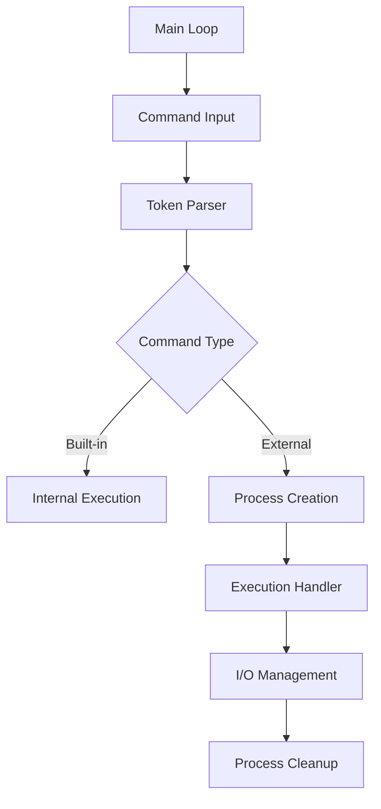

# 🚀 Quash Shell Implementation Report 📖

## Table of Contents
- [Overview](#overview)
- [Design Choices](#design-choices)
- [Code Documentation](#code-documentation)
- [Implementation Challenges](#implementation-challenges)
- [Future Improvements](#future-improvements)

---

## Overview

**Quash** is a Unix-like shell implementation written in C that provides a robust command-line interface. This project demonstrates core shell functionality including built-in commands, process management, I/O redirection, and pipe operations.

---

## Design Choices

### Core Architecture 🏗️


## Built-in Commands 🛠️

| Command | Description               | Implementation                         |
| ------- | ------------------------- | -------------------------------------- |
| `cd`    | Directory navigation      | Direct system call using `chdir()`     |
| `pwd`   | Print working directory   | Uses `getcwd()`                        |
| `echo`  | Text output               | Custom implementation with variable expansion |
| `env`   | Environment variables     | Direct access to `environ`             |
| `setenv`| Set environment variable  | Uses `setenv()`                        |
| `exit`  | Shell termination         | Clean process termination              |

---

## Process Management 📊

### Foreground Process Handling

```c
if (!is_background) {
    foreground_pid = pid;
    alarm(10); // 10-second timeout
    waitpid(pid, NULL, 0);
    alarm(0);
    foreground_pid = -1;
}
```
## Signal Handling

```c
void handle_sigint(int sig) {
    printf("\n");
    print_prompt();
    fflush(stdout);
}
```
## Code Documentation

1. **Command Processing Pipeline**

### Tokenization

```c
void tokenize_command(char *command_line, char *arguments[], int *arg_count) {
    // Handles:
    // - Quoted strings ("example")
    // - Environment variables ($VAR)
    // - Command separators
    // ...
}
```
2. **I/O Redirection Implementation**

### File Redirection

```c
// Output redirection (>)
int fd = open(file, O_WRONLY | O_CREAT | O_TRUNC, 0644);
dup2(fd, STDOUT_FILENO);

// Input redirection (<)
int fd = open(file, O_RDONLY);
dup2(fd, STDIN_FILENO);
```
### Pipe Implementation

```c
int pipefd[2];
pipe(pipefd); 
// First process
dup2(pipefd[1], STDOUT_FILENO);
// Second process
dup2(pipefd[0], STDIN_FILENO);
```

## Implementation Challenges

1. **Environment Variable Handling** 🔄  
   *Challenge*: Parsing and expanding environment variables in commands.

   ```c
   if (buffer[0] == '$') {
       char *env_value = getenv(buffer + 1);
       arguments[i] = env_value ? strdup(env_value) : strdup("");
   }
```
2. **Process Timeout Management** ⏱️  
   *Challenge*: Implementing timeout for foreground processes.

   ```c
   void handle_timer_alarm(int sig) {
       if (foreground_pid > 0) {  
           printf("\nProcess timed out. Terminating...\n");
           kill(foreground_pid, SIGKILL); 
           foreground_pid = -1;          
       }
   }
```
3. **Quote Handling** 📝  
   *Challenge*: Proper parsing of quoted strings.

   ```c
   while (*command_line != '\0' && *command_line != '\n') {
       if (!in_quotes) {
           if (*command_line == '"' || *command_line == '\'') {
               in_quotes = true;
               quote_char = *command_line;
               // ...
           }
       }
   }
```
## Future Improvements

1. **Job Control Enhancement**
   - Implement job listing functionality
   - Add job suspension/resumption features
   - Enhance background process management

2. **Command History**
   - Add command history storage
   - Implement history search
   - Add command line editing capabilities

3. **Shell Scripting Support**
   - Basic scripting capabilities
   - Control structures (if/else, loops)
   - Variable assignments and arithmetic

---

The shell has been tested with various scenarios including:
- Command execution
- I/O redirection
- Pipe operations
- Signal handling
- Process management

This project was developed as part of a Howard University operating systems course implementation.

